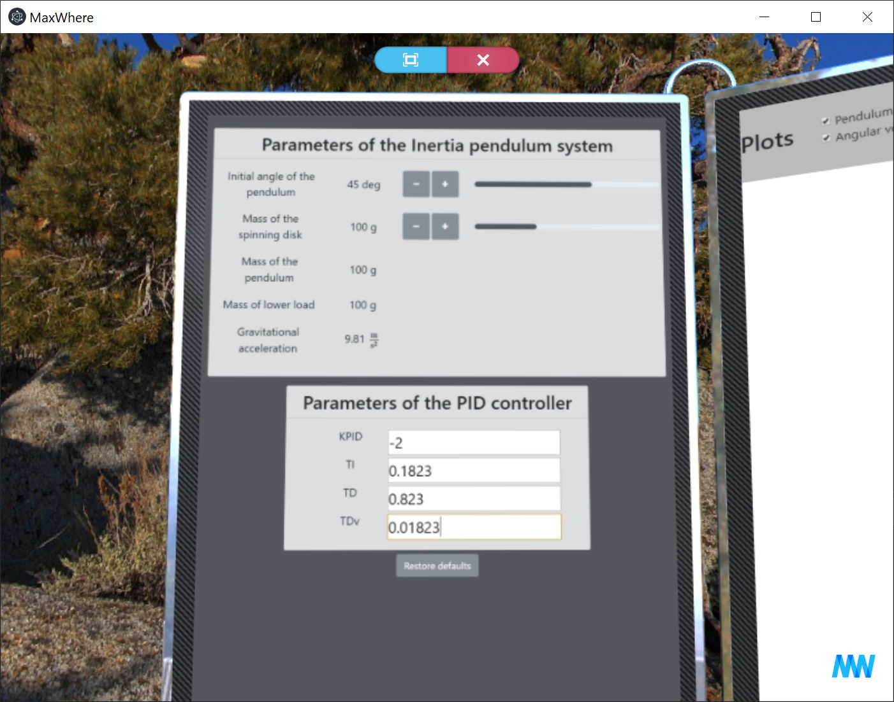

# Billboard

> A [`Webtable`](webtable.md) with ready-only content

`Billboard` is a specific type of `Webtable`, which initialized with the following properties
- `urlControls: false`
- `transparent` is `true` by default (contrary to `Webtable`)

As a result, `Billboard`s have no navigation bar UI, but is a fully functional `Webtable` instance in any other sense.

_Billboards are usually used for control panels of apps in conventional Wheres_

## `new Billboard([options])`
To create and insert `Billboard` into `wom` tree use `wom.create('billboard', [options])`!
* `options` Object (optional) - Contains the same properties as [`Webtable` constructor's](webtable.md#new-webtableoptions) options. See `Webtable` documentation for details.

## Instance Events
See `Webtable` instance events.

## Instance Properties
See `Webtable` instance properties.

## Instance methods
See `Webtable` instance methods.

