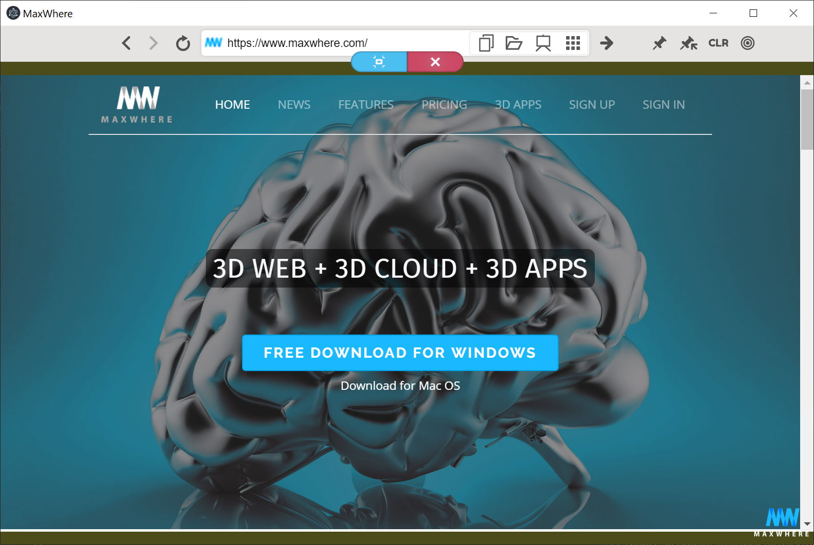

# Webtable

> A `Component` consists of a [`Webview`](webview.md) and UI [`Overlay`](overlay.md)s implementing a web browser with special features.

`Webtable`s can be used without any further adjustment. Mouse and keyboard inputs are handled automatically. UI `Overlay`s are opening when the `Webview` is selected in the 3d scene by click or double click. UI contains navigation and editing tools to use wecontent or local files in the webview. Ways of how the user can interact with the `Webtable` are adjustable as well via instance methods.

<!-- ## Features overview -->

## `new Webtable([options])`
To create and insert `Webtable` into `wom` tree use `wom.create('webtable', [options])`!
* `options` Object (optional)
  - `index` Number - Index number of webtable, which is used as a reference to this webtable instance (and displayed on default maxwhere page).
  - `gaInfo` Object {tracker, client, name, version} - GA info to insert into maxwhere pages when one is loaded. _Order of object properties should follow the specified order_ 
  - `private` Boolean - Whether this webtable should be excluded from bundle export.
  <!-- - `tabs` Boolean - _Not fully supported_ -->
  - `'auto-resolution'` Boolean - Whether the resolution of the webview should be automatically calculated from the resolution and pixel scale factor of the containing display. If defined, `'resolution-width'` and `'resolution-height'` options will not be applied. _The auto-generated resolution will precisely match the covered screen resolution in zoomed-in state_
  - `urlControls` Boolean - Whether to create URL control UI overlay bar to this webtable. Without URL control bar the content of the webview cannot be changed. (See [`Billboard`](billboard.md)) Default is `true`
  - `savedURL` String - Pinned URL, which can be loaded with 'Return to Pin' and overwritten with 'Pin'. _Considered as the user's personal saved URL_
  - `factoryURL` String - Factory default URL, which can be loaded with 'Return to default'. _Considered as the Home URL defined by the designer of the Where_
  - `url` String - Current URL to load after webtable is successfully initialized. Default is maxwhere default page (overrides `Webview` default).
  - `preload` String | String[] - Path(s) of preload script(s) used in webtable's webview (overrides `Webview` option to accept multiple preload scripts)

_`options` are superset of `Webview` constructor's options! Only `Webtable` specific properties are listed here. For the rest see [`new Webview([options])`](webtable.md#new-webtableoptions)_

_The same options are loaded from `webtables.json` in case of loading a conventional Where_

## Instance Events
The following events are emitted from webtable instances. They are basically for internal use of managing up-to-date `webtables.json` for conventional Wheres, but can be used for detecting important interactions on the webtable.

#### `'navigated'`
URL of webtables's content has been changed
- `mxwurl` Object [`MXWUrl`](https://github.com/MaxWhere/mxw-url) The current content URL

#### `'pin'`
Current URL is about to be pinned (saved as `savedURL`)
- `current` Object [`MXWUrl`](https://github.com/MaxWhere/mxw-url) The current content URL

#### `'set-factory-default'`
Current URL is about to be stored as `factoryURL`
- `current` Object [`MXWUrl`](https://github.com/MaxWhere/mxw-url) The current content URL

#### `load-local'`
Local content is about to be loaded into webtable

#### `'create-slideshow'`
A slideshow of local files is about to be loaded into webtable

## Instance properties

### `webtable.webview`
The [`Webview`] of the webtable. Provides access to the displayed content.

### Per intance properties
Properties which can be different for every webtable instance 

#### `webtable.index`
A Number indicating the index of webtable, which is used as a reference to this instance

#### `webtable.isSelected`
Boolean indicating whether the webtable is in selected state. In selected state the webview is activated in 3d scene and control UI overlays are visible 

#### `webtable.isZoomedIn`
Boolean indicating whether the webtable is in zoomed-in state. When zoomed, the webview is activated on the overlay and control UI elements are visible 

#### `webtable.savedURL`
String containing the pinned URL, which can be loaded with 'Return to Pin' and overwritten with 'Pin'. _Considered as the user's personal saved URL_

#### `webtable.factoryURL`
String containing the factory default URL, which can be loaded with 'Return to default'. _Considered as the Home URL defined by the designer of the Where_

#### `webtable.urlControls`
Boolean defining whether URL control UI overlay bar should be created to this webtable. Without URL control bar the content of the webview cannot be changed. (See [`Billboard`](billboard.md)) Default is `true`

#### `webtable.zoomFitArea`
Object storing the zoom parameters in case of auto-generated resolution. _Parameters are calculated from the active display's resolution, pixel scale factor and webview's size. When zoomed, the webview will have the same pixel size as the covered area on the display_
- `width` Number - Width of fitting are in pixels
- `height` Number - Height of fitting area in pixels
- `x` Number - Position of fitting area on screen's vertical axis
- `y` Number - Position of fitting area on screen's horizontal axis

#### `webtable.gaInfo`
Object containing the GA info inserted into maxwhere pages when one is loaded

#### `webtable.private`
Boolean indicating whether this webtable should be excluded from bundle export.

<!-- this.tabs, this.tabsEnabled -->

### Monostate properties
Properties which are the same for every webtable instance. Objects of UI elements which every webtable instance share among each other

#### `webtable.baseNode`
`Persistent Node` which serves as a root for UI element overlays. _Overlays added onto this node cannot be deleted, thus they persist between Wheres_

#### `webtable.zoomOverlay`
[`Overlay`](overlay.md) on which the webview content is rendered in case of auto-generated resolution

#### `webtable.messageArea`
[`Overlay`](overlay.md) used for displaying toast messages of the webtable

#### `webtable.statusBar`
[`Overlay`](overlay.md) containing the Exit and Zoom buttons below the navigation bar

#### `webtable.tooltipOverlay`
[`Overlay`](overlay.md) used for displaying tooltip texts for navigation bar and status bar buttons

#### `webtable.authBar`
[`Overlay`](overlay.md) used for authentication when a webpage requests one

#### `webtable.navigationBar`
[`Overlay`](overlay.md) containing the navigation buttons (Reload, Back, etc.), utility buttons (Pin, Default, etc.) and URL input on the top bar of the screen 

<!-- this.capturedOverlay -->

## Instance methods

#### `webview.zoomIn([done])`
Moves the camera to webview of this webtable and focus on it by enabling inputs on it and opening UI overlays for manipulation. _Camera pose is calculated from `Webview` dimensions._
- `done` Function (optional) - Called after the webtable is successfully zoomed in

#### `webview.zoomOut([animate])`
Moves the camera back away from webview of this webtable and unfocus it by disabling inputs on it and closing UI overlays. _Camera moves to the pose which preceded the zooming._
- `animate` Boolean (optional) - Whether the camers should be animated on its path back.

#### `webview.zoomBack()`
Moves the camera back away from webview of this webtable and keeps it selected (UI overlays remains visible)

#### `webview.showControls()`
Shows navigation and status bar overlays. _If `urlControls` is disabled navigation bar is not shown_ 

#### `webview.hideControls()`
Hides navigation and status bar overlays.

#### `webview.hideOtherOverlays()`
Hides every overlay in `wom` which not belongs to this webtable

#### `webview.reshowOtherOverlays()`
Shows overlays in `wom` which are temporary hidden by `hideOtherOverlays`

#### `webview.focus()`
Focuses input on the webview of this webtable. _Internal function, use select for full state change_

#### `webview.blur()`
Unfocuses input on the webview of this webtable. _Internal function, use unselect for full state change_

#### `webview.select()`
Selects this webtable. Gives input focus to the webview and opens UI overlays for manipulation.

#### `webview.deselect()`
Removes selected state of this webtable. Removes input focus of the webview and closes UI overlays.

#### `webview.isVertical()`
Returns Boolean indicating whether the webview size of this webtable is considered vertical. _If `height` is greater than `1.25` * `width`, the webview is considered vertical_

#### `webview.zoomOutOrDeselect([animate])`
Unfocusing this webtable by either zooming out from it (if `isZoomedIn`) or deselect it (if not `isZoomedIn`).
- `animate` Boolean (optional) - Whether the camers should be animated on its path back.

#### `webview.approachOrPullBack()`
Approaching the webview of this webtable with the camera or moves the camera back to its previous position. When approached, the webview is visible in front of the camera but rendering is not forwarded to the `zoomOverlay` and UI overlays are not opened. 

#### `webview.animateCamera([done])`
Moves camera to the webview of this webtable or away from it. The movement depends on the current state of the webtable. _Internal function, use `select/unselect/zoomIn/zoomOut` for full state change along with the camera animation_
- `done` Function (optional) - Called when the camera movement is done.

#### `webview.changeURL(url)`
Changes URL displayed in navigation bar overlay. _Internal function, actual content load of `loadWebviewURL/safeLoadWebviewURL` will chage the displayed URL anyway_
- `url` [`MXWUrl`](https://github.com/MaxWhere/mxw-url) - URL to display on navigation bar

#### `webview.currentURL()`
Returns [`MXWUrl`](https://github.com/MaxWhere/mxw-url) the content URL of the currently active webtable. _The returned URL is dehandled, thus can contain protocols meaningful only in maxwhere_

#### `webview.goBackInHistory()`
Navigates the content of webview back with one entry in the browsing history (if any).

#### `webview.goForwardInHistory()`
Navigates the content of webview forward with one entry in the browsing history (if any).

#### `webview.safeReload([done])`
Reloads the current content of the webview. _Safe means it won't wait the operation to finish for ever (timeout limit is 10 s)_
- `done` Function (optional) - Called when reload was successful or the time limit has passed.

_Alias: `reload()`_

#### `webview.loadWebviewURL(url[, opts])`
Loads the specified URL to the webview of this webtable
- `url` String | [`MXWUrl`](https://github.com/MaxWhere/mxw-url) - URL to load to the webview
- `opts` Object {urlOptions, force} (optional) - Options of operation. `force` ignores any URL handling before load and `urlOptions` are passed to [`Webview.loadURL`](webview.md#webviewloadurlurl-options)

#### `webview.safeLoadWebviewURL(url[, done, opts])`
Loads the specified URL to the webview of this webtable. _Safe means it won't wait the operation to finish for ever (timeout limit is 10 s)_
- `url` String | [`MXWUrl`](https://github.com/MaxWhere/mxw-url) - URL to load to the webview
- `opts` Object {urlOptions, force} (optional)- Options of operation. `force` ignores any URL handling before load and `urlOptions` are passed to [`Webview.loadURL`](webview.md#webviewloadurlurl-options)
- `done` Function (optional) - Called when load URL was successful (DOM of page is ready) or the time limit has passed.

#### `webview.setHotEdges(enable)`
Sets whether moving the mouse to the edges of the native window should deselect webtable or not. _Not meant to be used directly as it's overwritten by many internal behavior_
- `enable` Boolean - Enable or disable hot edge feature

#### `webview.pin()`
Pins the current URL. That is the current URL will be stored as `savedURL`. _Action button is available on navigation bar_

#### `webview.pinReturn([done])`
Safely loads `savedURL` into the webview. _'Pin' button is available on navigation bar_
- `done` Function (optional) - Called when the content is successfully loaded.

#### `webview.setFactoryURL([done])`
Safely loads `factoryURL` into the webview. _'Return to default' button is available on navigation bar_
- `done` Function (optional) - Called when the content is successfully loaded.

#### `webview.resetFactoryURL()`
Sets `factoryURL`. _`factoryURL` can be loaded with 'Return to default' button on navigation bar_

#### `webview.setZoomedIn(zoomed)`
Sets the zoomed-in state of this webtable. _Not meant to be used directly. State changes are handled by higher level functions automatically_
- `zoomed` Boolean - Zoomed-in state to set

#### `webview.redirectPaint(enable)`
Redirects content rendering from 3d webview onto the `zoomOverlay`. _For getting a crispy look, the pixels size of the covered area should match the screens resolution. Calculated values of `zoomFitArea` contains these properties. Otherwise, any resolution and webview texture filtering can be used._
- `enable` Boolean - Whether to enable or disable rendering on `zoomOverlay`

#### `webview.clear()`
Removes this webtable from the 3d scene. webview is removed, shared UI overlays remains available. 

#### `webview.init([props])`
Component initialization. _It's a built-in [`wom.Component`](component.md) function of webtable. It's not meant to be used directly, but may be monkeypatched if additional actions required. The original code should be called in order to successfully create this instance in `wom`_
- `props` Object (optional) - Options for initialization. [Constructor](webtable.md#new-webtableoptions) arguments are passed here from `wom.create`.

#### `webview.render()`
Component rendering. _It's a built-in [`wom.Component`](component.md) function of webtable. It's not meant to be used directly, but may be monkeypatched if additional actions required. The original code should be called in order to successfully render this instance in `wom`_

#### `webview.done(webview)`
Component callback for successful instantiation. _It's a built-in [`wom.Component`](component.md) function of webtable. It's not meant to be used directly, but may be monkeypatched if additional actions required. The original code should be called in order to successfully create this instance in `wom`_
- `webview` [`Webview`](webview.md) object of this webtable instance. That is [`webtable.webview`](webtable.md#webtablewebview)

<!-- capture, unCapture, isCaptured, -->
<!-- selectTab, addTab, closeTab, refreshTabs, -->
